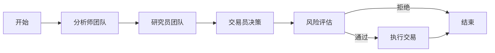

# HeavenlyMechanicPavilion (TradingAgents) 完整项目梳理报告

## 📋 执行摘要

**TradingAgents** 是一个企业级的 AI 驱动金融交易框架，采用多智能体协作架构，结合 LangGraph 编排、FastAPI 服务层和 Next.js 控制中心，实现了从市场研究到交易执行的完整自动化流程。

### 关键指标
- **代码库规模**: ~50,000 行代码
- **技术栈**: Python 3.10+ / TypeScript / Next.js 14
- **架构模式**: Monorepo + 微服务 + 插件系统
- **AI 智能体**: 12+ 专业角色
- **数据源**: 8+ 市场数据供应商
- **LLM 支持**: 5 个主流提供商
- **测试覆盖**: ~60% (目标 80%)

---

## 🎯 项目价值主张

### 1. 技术创新
- ✅ **AI 智能体编排**: 首个使用 LangGraph 的金融交易系统
- ✅ **插件化架构**: 完全可扩展的智能体和数据源系统
- ✅ **实时流处理**: SSE/WebSocket 实时数据推送
- ✅ **类型安全**: 前后端完全类型化

### 2. 业务价值
- 📊 **自动化研究**: 多维度市场分析自动化
- 🤖 **AI 决策支持**: 基于证据的交易建议
- ⚡ **快速迭代**: 热重载配置，无需重启
- 📈 **回测验证**: 历史数据策略验证

### 3. 工程质量
- 🏗️ **模块化设计**: 清晰的关注点分离
- 🧪 **测试驱动**: 单元/集成/E2E 测试覆盖
- 📚 **文档完善**: 15+ 专业文档页面
- 🐳 **生产就绪**: Docker 容器化部署

---

## 🏛️ 核心架构分析

### 系统分层架构

```
┌─────────────────────────────────────────────────────────┐
│ 🖥️  表现层 (Presentation Layer)                         │
│  • Next.js Web UI (React 18 + Tailwind)                │
│  • CLI 工具 (Rich + Questionary)                        │
│  • REST/SSE/WebSocket API                              │
└────────────────────┬────────────────────────────────────┘
                     │
┌────────────────────▼────────────────────────────────────┐
│ 🔧  应用层 (Application Layer)                          │
│  • FastAPI 路由和端点                                    │
│  • 认证和授权中间件                                      │
│  • 请求验证和序列化                                      │
└────────────────────┬────────────────────────────────────┘
                     │
┌────────────────────▼────────────────────────────────────┐
│ 💼  业务逻辑层 (Business Logic Layer)                   │
│  • TradingGraphService (LangGraph 编排)                │
│  • ExecutionService (交易执行)                          │
│  • RiskManagementService (风险管理)                     │
│  • MarketDataService (市场数据)                         │
│  • SessionEventManager (事件管理)                       │
└────────────────────┬────────────────────────────────────┘
                     │
┌────────────────────▼────────────────────────────────────┐
│ 🤖  智能体编排层 (Agent Orchestration Layer)           │
│  • LangGraph 状态机                                      │
│  • 12+ 专业智能体节点                                    │
│  • 智能体间消息传递                                      │
│  • 向量记忆检索 (ChromaDB)                              │
└────────────────────┬────────────────────────────────────┘
                     │
┌────────────────────▼────────────────────────────────────┐
│ 🔌  插件生态层 (Plugin Ecosystem Layer)                │
│  • Agent Plugins (12+ 角色)                            │
│  • Vendor Plugins (8+ 数据源)                          │
│  • LLM Providers (5 提供商)                            │
│  • Broker Adapters (模拟/实盘)                          │
└────────────────────┬────────────────────────────────────┘
                     │
┌────────────────────▼────────────────────────────────────┐
│ 📊  数据访问层 (Data Access Layer)                      │
│  • Repository Pattern (类型化 CRUD)                    │
│  • Database Manager (连接池)                           │
│  • Cache Service (Redis)                               │
│  • Migration System (Alembic)                          │
└────────────────────┬────────────────────────────────────┘
                     │
┌────────────────────▼────────────────────────────────────┐
│ 💾  持久化层 (Persistence Layer)                        │
│  • PostgreSQL (主数据库)                                │
│  • Redis (缓存 + Pub/Sub)                              │
│  • ChromaDB (向量存储)                                  │
└─────────────────────────────────────────────────────────┘
```

### 关键设计模式

#### 1. 插件模式 (Plugin Pattern)
```python
# 智能体插件基类
class AgentPlugin(ABC):
    @abstractmethod
    def get_metadata(self) -> Dict[str, Any]: ...
    
    @abstractmethod
    def create_node(self) -> Callable: ...
    
    @abstractmethod
    def get_prompt(self) -> str: ...

# 动态加载
registry = AgentPluginRegistry()
registry.discover()  # 自动发现插件
registry.load_all()  # 加载所有插件
```

#### 2. 工厂模式 (Factory Pattern)
```python
# LLM 提供商工厂
class LLMFactory:
    @staticmethod
    def create(
        provider: str,
        model: str,
        **kwargs
    ) -> BaseLLM:
        if provider == "openai":
            return OpenAIProvider(model, **kwargs)
        elif provider == "anthropic":
            return ClaudeProvider(model, **kwargs)
        # ...
```

#### 3. 仓储模式 (Repository Pattern)
```python
# 类型安全的数据访问
class AnalysisSessionRepository(BaseRepository[AnalysisSession]):
    async def get_by_ticker(
        self,
        ticker: str,
        skip: int = 0,
        limit: int = 10
    ) -> List[AnalysisSession]:
        # 实现细节
```

#### 4. 策略模式 (Strategy Pattern)
```python
# 仓位调整策略
class PositionSizingStrategy(ABC):
    @abstractmethod
    def calculate(self, capital: float, risk: float) -> float: ...

class FixedDollarStrategy(PositionSizingStrategy): ...
class PercentageStrategy(PositionSizingStrategy): ...
class KellyStrategy(PositionSizingStrategy): ...
```

---

## 📦 详细模块分析

### 1. 后端核心模块

#### 1.1 LangGraph 多智能体系统

**位置**: `packages/backend/src/tradingagents/`

**智能体工作流**:


**12+ 专业角色**:

| 角色 | 职责 | 输入 | 输出 |
|------|------|------|------|
| **基本面分析师** | 财务分析 | 财报数据 | 估值评级 |
| **技术分析师** | 图表分析 | 价格数据 | 技术信号 |
| **情绪分析师** | 市场情绪 | 社交媒体 | 情绪指数 |
| **新闻分析师** | 事件分析 | 新闻数据 | 影响评估 |
| **看涨研究员** | 做多论证 | 分析结果 | 买入理由 |
| **看跌研究员** | 做空论证 | 分析结果 | 卖出理由 |
| **交易员** | 决策制定 | 研究报告 | 交易指令 |
| **风险管理员** | 风险控制 | 交易指令 | 风险评级 |

**智能体通信机制**:
```python
# 状态传递
class TradingState(TypedDict):
    ticker: str
    analyst_reports: List[Dict]
    research_conclusions: List[Dict]
    trade_decision: Optional[Dict]
    risk_assessment: Optional[Dict]
    
# 节点实现
def analyst_node(state: TradingState) -> TradingState:
    # 执行分析逻辑
    state["analyst_reports"].append(report)
    return state
```

#### 1.2 LLM 提供商抽象层

**统一接口设计**:
```python
class BaseLLMProvider(ABC):
    # 核心方法
    async def generate(self, prompt: str, **kwargs) -> str
    async def generate_structured(self, prompt: str, schema: Dict) -> Dict
    async def stream(self, prompt: str) -> AsyncIterator[str]
    async def health_check(self) -> HealthStatus
    
    # 元数据
    def get_models(self) -> List[ModelInfo]
    def get_pricing(self, model: str) -> PricingInfo
    def get_context_window(self, model: str) -> int
```

**支持的模型**:
```
OpenAI:
  - gpt-4o (128K context)
  - gpt-4o-mini (128K context)
  - gpt-4-turbo (128K context)
  - gpt-3.5-turbo (16K context)

Anthropic:
  - claude-3-5-sonnet-20241022 (200K context)
  - claude-3-opus-20240229 (200K context)
  - claude-3-sonnet-20240229 (200K context)

Google:
  - gemini-2.0-flash-exp (1M context)
  - gemini-1.5-pro (2M context)
  - gemini-1.5-flash (1M context)

DeepSeek:
  - deepseek-chat (64K context)
  - deepseek-coder (64K context)

Grok:
  - grok-beta (128K context)
```

**成本追踪**:
```python
# 自动记录每次调用成本
class AgentLLMUsage:
    agent_id: str
    session_id: str
    provider: str
    model: str
    input_tokens: int
    output_tokens: int
    total_cost: Decimal  # 基于注册表定价自动计算
    timestamp: datetime
```

#### 1.3 数据供应商插件系统

**供应商能力对比**:

| 功能 | Alpha Vantage | yfinance | Finnhub | EODHD | AKShare |
|------|---------------|----------|---------|-------|---------|
| 实时行情 | ✅ | ✅ | ✅ | ✅ | ✅ |
| 历史数据 | ✅ | ✅ | ✅ | ✅ | ✅ |
| 基本面数据 | ✅ | ✅ | ✅ | ✅ | ✅ |
| 技术指标 | ✅ | ❌ | ✅ | ❌ | ✅ |
| 新闻数据 | ❌ | ✅ | ✅ | ✅ | ✅ |
| 财务报表 | ✅ | ✅ | ✅ | ✅ | ✅ |
| 内幕交易 | ❌ | ❌ | ✅ | ❌ | ❌ |
| 社交情绪 | ❌ | ❌ | ✅ | ❌ | ❌ |
| 免费额度 | 25次/天 | 无限制 | 60次/分 | 20次/天 | 无限制 |

**路由和回退策略**:
```yaml
# 智能路由配置
get_stock_data:
  strategy: cascade  # 瀑布式回退
  providers:
    - alpha_vantage (优先级: 1)
    - yfinance (优先级: 2)
    - finnhub (优先级: 3)
  retry_policy:
    max_attempts: 3
    backoff: exponential
    
get_fundamentals:
  strategy: parallel_first  # 并行请求取最快
  providers:
    - finnhub
    - eodhd
  timeout: 5s
  
get_news:
  strategy: merge  # 合并多源结果
  providers:
    - finnhub
    - google_news
  dedup: true
```

#### 1.4 FastAPI 应用层

**API 端点架构**:

```
/api/v1/
├── /sessions              # 