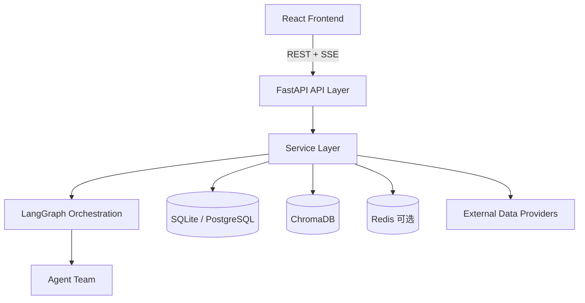

# 天机阁 · Stock Agents Monitor

> 基于多 Agent 对抗性辩论的金融情报监控系统 — 让 AI 团队为你研判市场

[](https://github.com/lingxuan/HeavenlyMechanicPavilion/actions/workflows/ci.yml)

<p align="center">
  
</p>

## 项目简介

天机阁是一个面向 A股/港股/美股 的多 Agent 金融情报系统。核心灵感来自论文 [TradingAgents: Multi-Agents LLM Financial Trading Framework](https://arxiv.org/abs/2412.20138)，通过 **分析师研究 → Bull vs Bear 对抗辩论 → 风险三方评估 → Trader 决策** 的完整链路，输出可追踪、可解释的结构化分析报告，并以实时大屏形式提供决策支持。

### 核心特性

- **多 Agent 协作**：12 个专业分析师 + 多空辩论 + 风险三方评估 + Trader/Portfolio 决策，由 LangGraph StateGraph 编排
- **分级分析**：L1 快速扫描（15-20s，无辩论）/ L2 深度研究（30-60s，完整辩论链路）
- **SSE 实时推送**：分析过程逐阶段推送（分析 → 辩论 → 风控 → 决策），前端实时渲染
- **智能数据路由**：根据 symbol 后缀自动选择数据源（AkShare / yfinance / Alpha Vantage），支持降级链
- **A股特色数据**：北向资金、龙虎榜、限售解禁、政策分析、央行文本 NLP
- **多维辅助**：自选股、组合分析、回测、研究对话记忆、新闻聚合、供应链分析
- **多 LLM 支持**：OpenAI / Anthropic / Google Gemini / DeepSeek，可通过 UI 动态切换
- **完整认证体系**：JWT + OAuth 2.0 (Google/GitHub) + WebAuthn/Passkey
- **通知推送**：分析完成后自动推送至 Telegram（企业微信/钉钉规划中）

## 技术栈

| 层级 | 技术选型 |
|------|----------|
| **前端** | React 19, Vite, TanStack Query, Tailwind CSS 4, TradingView Lightweight Charts, Framer Motion |
| **后端** | Python 3.10, FastAPI, LangGraph, SQLModel, Alembic |
| **AI 框架** | LangChain + LangGraph（fork 自 [TauricResearch/TradingAgents](https://github.com/TauricResearch/TradingAgents)）|
| **数据源** | AkShare, yfinance, Alpha Vantage, Finnhub, FRED, DuckDuckGo, Reddit |
| **存储** | SQLite / PostgreSQL, ChromaDB（向量），Redis（缓存/队列，可选）|
| **工程化** | Monorepo (Moon + pnpm), GitHub Actions CI, Docker Compose |

## 快速开始

### 前置条件

- Node.js 20+, pnpm 9+
- Python 3.10+, [uv](https://docs.astral.sh/uv/)
- [Moon](https://moonrepo.dev/)（可选但推荐）
- 至少一个 LLM API Key（OpenAI / Anthropic / Google）

### 方式一：Moon（推荐）

```bash
# 克隆仓库
git clone https://github.com/lingxuan/HeavenlyMechanicPavilion.git
cd HeavenlyMechanicPavilion

# 配置后端环境变量
cp apps/server/.env.example apps/server/.env
# 编辑 apps/server/.env，填入 LLM API Key

# 安装所有依赖
moon run :install

# 启动后端（http://localhost:8000）
moon run server:dev

# 新终端 — 启动前端（http://localhost:3000）
moon run client:dev
```

### 方式二：手动启动

```bash
# 后端
cd apps/server
uv sync
cp .env.example .env        # 编辑填入 LLM API Key
python main.py               # http://localhost:8000

# 前端（新终端）
cd apps/client
npm install
npm run dev                  # http://localhost:3000
```

### 方式三：Docker Compose

```bash
cp .env.example .env
# 编辑 .env，填入必要配置

# 基础部署（SQLite）
docker compose up

# 完整部署（+ PostgreSQL + Redis）
docker compose --profile postgresql --profile cache up
```

> **最小配置**：只需在 `.env` 中设置一个 LLM API Key 即可启动。SQLite 为默认数据库，无需额外配置。

## 系统架构



### 分析数据流

```
用户触发分析 → POST /api/analyze/{symbol} → 返回 task_id
    ↓
任务入队: BackgroundTask (dev) / Redis Stream (prod)
    ↓
LangGraph StateGraph 逐节点执行
    ↓
  ┌─ Planner Agent → 自适应选择分析师
  ├─ Analyst SubGraph → 多维并行分析
  ├─ Bull vs Bear Debate → 多空对抗辩论
  ├─ Risk 三方辩论 → 激进/中性/保守评估
  ├─ Trader/Portfolio 决策 → 生成交易建议
  └─ ResponseSynthesizer → Markdown → 结构化 JSON
    ↓
SSE 实时推送 → GET /api/analyze/stream/{task_id}
    ↓
前端 useStreamingAnalysis() → 逐阶段渲染
```

### 多市场数据路由

| 市场 | Symbol 格式 | 主数据源 | 降级数据源 |
|------|-------------|----------|------------|
| A股 | `600519.SH` / `000001.SZ` | AkShare | yfinance |
| 港股 | `0700.HK` | yfinance | AkShare |
| 美股 | `AAPL` / `TSLA` | yfinance | Alpha Vantage |

## 项目结构

```
HeavenlyMechanicPavilion/
├── apps/
│   ├── client/                  # React 19 + Vite 前端
│   │   ├── index.tsx            # 路由配置 + QueryClient
│   │   ├── services/api.ts      # 统一 API 层（REST + SSE）
│   │   ├── hooks/               # 26 个 TanStack Query hooks
│   │   ├── components/          # UI 组件（layout/auth/common）
│   │   ├── pages/               # 14 个页面（懒加载）
│   │   └── src/types/           # OpenAPI 自动生成类型 + 前端类型
│   │
│   └── server/                  # Python 3.10 + FastAPI 后端
│       ├── main.py              # 应用入口
│       ├── api/
│       │   ├── routes/          # 4 大路由域（market/analysis/trading/system）
│       │   └── schemas/         # Pydantic 请求/响应 schema
│       ├── services/            # 41 个业务服务模块
│       ├── workers/             # Redis Stream Worker
│       ├── config/              # 配置管理 + Prompt 注册表
│       ├── db/                  # SQLModel ORM + Alembic 迁移
│       └── tradingagents/       # 核心 AI Agent 框架
│           ├── graph/           # LangGraph StateGraph + SubGraph
│           ├── agents/          # 分析师/研究员/风控/交易员
│           └── dataflows/       # 多数据源适配器
│
├── docs/                        # 项目文档
├── .github/workflows/           # CI/CD 流水线
└── docker-compose.yml           # Docker 编排
```

## 开发指南

### 常用命令

```bash
# 全栈操作（Moon）
moon run :lint                   # 全栈 lint
moon run :typecheck              # 全栈类型检查
moon run :test                   # 全栈测试
moon run :format                 # 全栈格式化

# 后端（apps/server/）
pytest                           # 运行所有测试
pytest tests/unit/ -v            # 仅单元测试
pytest tests/integration/ -v     # 仅集成测试
ruff check . --fix               # lint + 自动修复
mypy api/ services/ config/ db/  # 类型检查

# 前端（apps/client/）
npm run build                    # 生产构建
npx tsc --noEmit                 # 类型检查
npm run gen:types                # 从后端 OpenAPI 重新生成类型
npm run lint:fix                 # ESLint 自动修复
```

### 前后端类型同步

后端修改响应模型后，需重新生成前端类型以保持合约一致：

```bash
# 确保后端运行中（http://localhost:8000）
cd apps/client
npm run gen:types                # 拉取 OpenAPI schema → 生成 src/types/generated/
npm run gen:types:check          # CI 模式：仅检查是否过期
```

### 数据库迁移

```bash
cd apps/server
alembic revision --autogenerate -m "add new column"  # 生成迁移
alembic upgrade head                                  # 应用迁移
alembic downgrade -1                                  # 回滚
```

### 生产模式（Redis 任务队列）

```bash
# 启动 Redis
docker compose --profile cache up -d

# 配置环境变量
# USE_TASK_QUEUE=true
# REDIS_URL=redis://localhost:6379

# 启动 Worker（可多实例水平扩展）
cd apps/server
uv run python -m workers.analysis_worker --name worker-1
uv run python -m workers.analysis_worker --name worker-2
```

## 环境变量

复制模板并按需配置：

```bash
# 后端
cp apps/server/.env.example apps/server/.env

# Docker 部署
cp .env.example .env
```

| 分类 | 关键变量 | 说明 |
|------|----------|------|
| **LLM（至少一项）** | `OPENAI_API_KEY`, `ANTHROPIC_API_KEY`, `GOOGLE_API_KEY` | LLM 服务密钥 |
| **数据库** | `DATABASE_MODE`, `DATABASE_URL` | `sqlite`（默认）或 `postgresql` |
| **缓存/队列** | `REDIS_URL`, `USE_TASK_QUEUE` | 生产模式启用 Redis Stream |
| **认证** | `JWT_SECRET_KEY`, `GOOGLE_CLIENT_ID/SECRET`, `GITHUB_CLIENT_ID/SECRET` | JWT + OAuth |
| **数据源** | `ALPHA_VANTAGE_API_KEY`, `FRED_API_KEY`, `FINNHUB_API_KEY` | 金融数据 API |
| **通知** | `TELEGRAM_BOT_TOKEN` | Telegram 推送 |
| **可观测性** | `LANGSMITH_API_KEY`, `LANGSMITH_ENABLED` | LangSmith 追踪 |

> 完整变量列表见 [docs/CONTRIB.md](docs/CONTRIB.md)

## 健康检查

| 端点 | 用途 |
|------|------|
| `GET /health` | 基础探针 |
| `GET /api/health/report` | 完整健康报告 |
| `GET /api/health/liveness` | K8s liveness |
| `GET /api/health/readiness` | K8s readiness |
| `GET /api/health/api-metrics` | API 指标监控 |

## 文档

| 文档 | 说明 |
|------|------|
| [docs/ARCH.md](docs/ARCH.md) | 系统架构设计（分层架构、Mermaid 图、数据源映射） |
| [docs/PRD.md](docs/PRD.md) | 产品需求文档（功能范围、目标用户、版本规划） |
| [docs/CONTRIB.md](docs/CONTRIB.md) | 贡献指南（环境变量完整列表、AI 配置系统、开发工作流） |
| [docs/RUNBOOK.md](docs/RUNBOOK.md) | 运维手册（部署、监控、故障排查、回滚） |

## 致谢

- [TauricResearch/TradingAgents](https://github.com/TauricResearch/TradingAgents) — 核心 Agent 框架来源
- [TradingAgents 论文 (arXiv:2412.20138)](https://arxiv.org/abs/2412.20138) — 多 Agent 金融交易框架的理论基础
