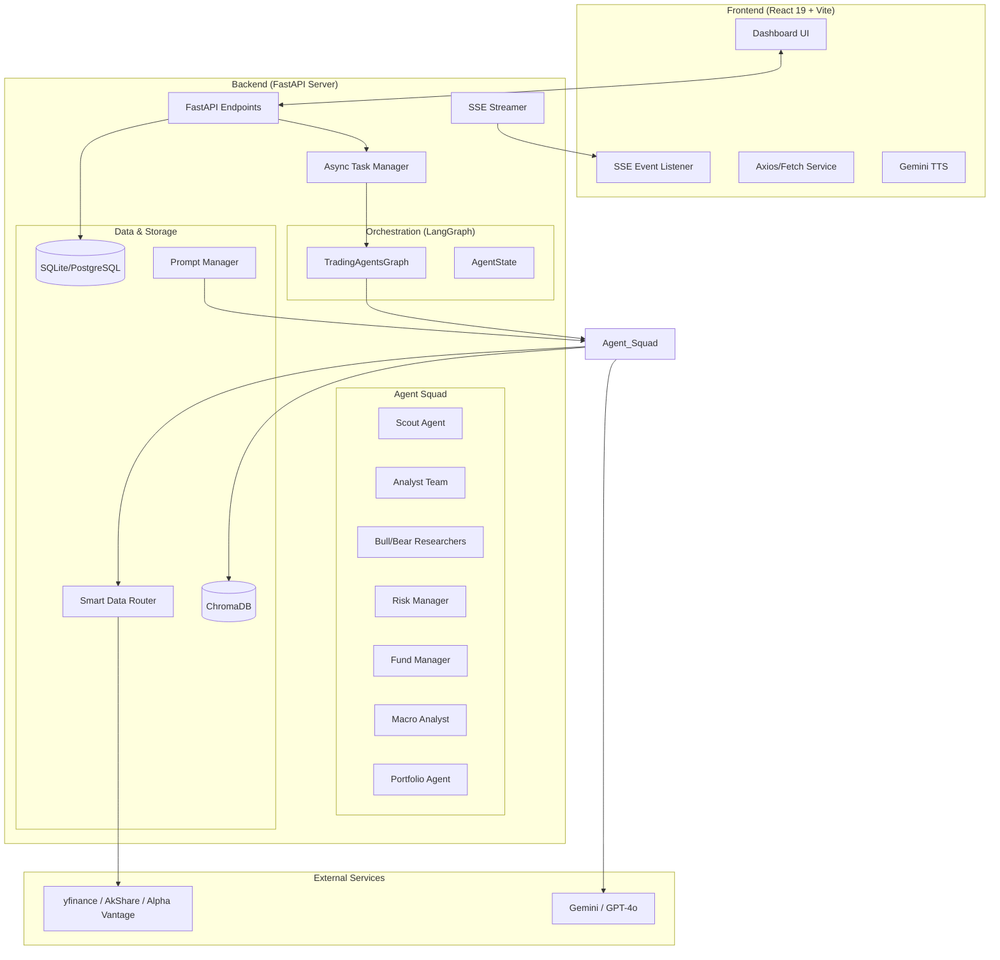

# 股票 Agents 监控大屏 系统架构文档 (ARCH.md)

## 1. 系统概述
本项目是一个基于 **TradingAgents** 框架的专业级金融情报监控系统。它通过多 Agent 协作（Multi-Agent Orchestration）对全球股票市场（A股、港股、美股）进行深度分析，并以实时大屏的形式提供决策支持。

## 2. 总体架构图



## 3. 核心分层设计

### 3.1 API 层 (FastAPI)
- **REST API**：处理 Watchlist 管理、历史数据查询、Prompt 配置等同步操作。
- **SSE (Server-Sent Events)**：用于流式推送 Agent 分析进度（Workflow Timeline）和实时快讯。
- **Task Manager**：管理长耗时的 Agent 分析任务。使用 FastAPI 的 `BackgroundTasks` 启动分析，并在内存/数据库中维护任务状态（Pending, Running, Completed, Failed）。
- **Log Interceptor**：捕获 LangGraph 运行期间的标准输出或特定日志，将其转换为 SSE 事件实时推送到前端。

### 3.2 编排层 (LangGraph)
- **状态机管理**：利用 LangGraph 定义 Agent 之间的流转逻辑（如：分析 -> 辩论 -> 风险评估 -> 决策）。
- **Checkpointer**：使用 `SqliteSaver` 实现任务进度的持久化，支持分析中断后的恢复。

### 3.3 Agent 团队 (Agent Squad)
- **Scout (发现者)**：基于语义搜索发现潜在投资标的。
- **Analyst (分析师)**：多维度数据抓取（技术面、基本面、新闻面）。
- **Researcher (研究员)**：多空对抗辩论，消除 AI 幻觉。
- **Risk Manager (风险经理)**：下行风险评估与一票否决。
- **Fund Manager (基金经理)**：最终决策合成与主播稿（Anchor Script）生成。
- **Macro Analyst (宏观分析师)**：全局宏观环境注入。
- **Portfolio Agent (组合专家)**：跨标的相关性与风险分散分析。

### 3.4 核心 Agent 深度设计
#### 3.4.1 Scout Agent (发现者)
- **流程**：用户输入 -> LLM 提取关键词 -> Google Search 搜索标的 -> DataRouter 验证 Ticker 并获取基础行情 -> LLM 排序并生成推荐理由。
- **输出**：`MarketOpportunity[]`。

#### 3.4.2 Portfolio Agent (组合专家)
- **流程**：获取 Watchlist -> DataRouter 抓取所有标的 30 天历史收益率 -> 计算相关性矩阵 (Pearson Correlation) -> 识别风险集中度 -> 生成组合建议。
- **输出**：相关性热力图数据及文字建议。

### 3.5 数据路由层 (Smart Data Router)
- **多市场适配 (MarketRouter)**：
    - 实现一个 `MarketRouter` 类，封装现有的 `interface.py`。
    - **路由规则**：
        - `symbol` 匹配 `\d{6}\.(SH|SZ)` -> 路由至 `AkShare` 插件。
        - `symbol` 匹配 `\d{5}\.HK` -> 路由至 `yfinance` (代码转换为 `0000.HK`) 或 `AkShare`。
        - 其他 -> 路由至 `yfinance` 或 `Alpha Vantage`。
- **统一模型转换**：
    - 使用 Pydantic 定义 `MarketData` 统一模型。
    - 每个数据源插件负责将原始响应（如 `yfinance` 的 DataFrame 或 `AkShare` 的 Dict）转换为 `MarketData`。
- **数据源映射表**：
    | 数据项 | A 股 (CN) | 港股 (HK) | 美股 (US) |
    | :--- | :--- | :--- | :--- |
    | 实时价格 | AkShare (`stock_zh_a_spot_em`) | yfinance / AkShare | yfinance |
    | 历史 K 线 | AkShare (`stock_zh_a_hist`) | yfinance | yfinance |
    | 技术指标 | stockstats (基于 K 线计算) | stockstats | yfinance / stockstats |
    | 财务报表 | AkShare (`stock_financial_report_sina`) | yfinance | yfinance / Alpha Vantage |
    | 实时新闻 | AkShare / 东方财富 | Google News / yfinance | Alpha Vantage / Google News |
- **历史 K 线支持**：
    - 增加 `get_history_kline(symbol, period)` 接口，支持前端图表展示。

### 3.6 数据合成与对齐 (Synthesis)
由于 Agent 输出多为自然语言，系统引入 `ResponseSynthesizer`：
1. **输入**：`AgentState` 中的所有原始报告（Markdown）。
2. **处理策略**：
    - **Few-shot Prompting**：提供 2-3 个 Markdown 到 JSON 转换的示例，确保 LLM 理解复杂的 `debate` 和 `riskAssessment` 嵌套结构。
    - **Schema Enforcement**：使用 Pydantic 的 `model_json_schema()` 生成 Prompt 中的输出规范。
3. **主播稿生成**：专门生成一段为 TTS 优化的 `anchor_script`，去除 Markdown 格式，增加口播语气。
4. **输出**：严格符合前端 `types.ts` 的 `AgentAnalysis` JSON 对象。

### 3.7 存储与配置层
- **SQL 数据库 (Schema 设计)**：
    - `Watchlist`: `id, symbol, name, market, added_at`
    - `AnalysisResult`: `id, symbol, date, signal, confidence, full_report_json, anchor_script, created_at`
    - `ChatHistory`: `id, thread_id, role, content, created_at`
- **Prompt 管理器 (PromptManager)**：
    - **存储**：使用 `apps/server/config/prompts.yaml` 作为持久化存储。
    - **YAML 结构示例**：
      ```yaml
      market_analyst:
        system: "你是一个资深技术分析师，分析 {symbol} 的 K 线和指标..."
        user: "请分析以下数据：{data}"
      bull_researcher:
        system: "你是一个坚定的多头研究员..."
      ```
    - **加载**：`PromptManager` 类负责解析 YAML 并提供 `get_prompt(role, context)` 方法。
    - **变量注入**：支持在 Prompt 中使用 `{symbol}`, `{company_name}`, `{trade_date}` 等占位符。
    - **热更新**：监听文件变化或通过 API 触发 `reload()`。
    - **Chat Context Injection**：在对话接口中，系统会自动注入该股票最新的 `AnalysisResult` 作为 System Message 的背景，确保 Agent 了解当前的分析结论。
    - **向量数据库 (ChromaDB)**：
    - **持久化**：配置 ChromaDB 使用本地目录（如 `apps/server/db/chroma`）进行持久化存储。
    - **索引**：按 `symbol` 和 `date` 建立索引，支持快速检索历史相似案例。
- **市场知识库 (Market Knowledge Base)**：
    - 在 Prompt 中注入特定市场的规则（如 A 股的涨跌停限制、T+1 交易制度），增强 Agent 的专业性。

## 4. API 接口定义 (OpenAPI 规范)

### 4.1 Watchlist 接口
- `GET /api/watchlist`: 获取所有关注股票。
- `POST /api/watchlist`: 添加股票 `{symbol, market}`。
- `DELETE /api/watchlist/{symbol}`: 移除股票。

### 4.2 分析接口
- `POST /api/analyze/{symbol}`: 触发异步分析，返回 `task_id`。
- `GET /api/analyze/stream/{task_id}`: SSE 流式获取进度与结果。
- `GET /api/analyze/latest/{symbol}`: 获取最近一次分析结果。

### 4.3 市场与快讯
- `GET /api/market/global`: 获取全球指数行情。由 `MarketService` 定时（如每 5 分钟）抓取并缓存。
- `GET /api/news/flash`: 获取实时财经快讯。由 `NewsService` 聚合多个源（Alpha Vantage, Google News）并缓存。
- `POST /api/scout`: 股票发现接口 `{query}`。调用专门的 `ScoutGraph` 或 `ScoutAgent` 进行语义搜索。

### 4.4 对话与设置
- `POST /api/chat`: 与 Fund Manager 对话 `{thread_id, message}`。
- `GET /api/settings/prompts`: 获取当前 Prompt 配置。
- `PUT /api/settings/prompts`: 更新 Prompt 配置。

## 5. 关键技术特性

### 5.1 实时进度推送 (Real-time Progress)
后端在 LangGraph 的每个节点执行完成后，通过 SSE 发送特定事件，事件名需与前端 `StockDetailModal.tsx` 中的 `WorkflowStep` 对应：
- `event: stage_analyst`: 对应 "Analyst Team"
- `event: stage_debate`: 对应 "Bull/Bear Debate"
- `event: stage_risk`: 对应 "Risk Check"
- `event: stage_final`: 对应 "Fund Manager"
- **数据格式**：`data: {"status": "completed", "message": "...", "payload": {...}}`

### 5.2 像素级 API 对齐 (JSON Contract)
后端 `POST /api/analyze` 的最终响应（及 SSE 的 `final_decision` 数据）必须严格遵循以下结构：

```json
{
  "symbol": "AAPL",
  "timestamp": "10:30:00 AM",
  "signal": "Strong Buy",
  "confidence": 85,
  "reasoning": "基于技术面突破和强劲的财报预期...",
  "anchor_script": "各位投资者，早上好。今天我们深度分析了苹果公司...",
  "debate": {
    "bull": { "thesis": "...", "points": [{ "argument": "...", "evidence": "...", "weight": "High" }] },
    "bear": { "thesis": "...", "points": [...] },
    "winner": "Bull",
    "conclusion": "..."
  },
  "riskAssessment": {
    "score": 3,
    "volatilityStatus": "Moderate",
    "liquidityConcerns": false,
    "maxDrawdownRisk": "-5%",
    "verdict": "Approved"
  },
  "technicalIndicators": { "rsi": 45, "macd": "Golden Cross", "trend": "Bullish" },
  "tradeSetup": {
    "entryZone": "185.00 - 187.00",
    "targetPrice": 210.0,
    "stopLossPrice": 180.0,
    "rewardToRiskRatio": 3.5
  },
  "newsAnalysis": [{ "headline": "...", "sentiment": "Positive", "summary": "..." }]
}
```

### 4.3 记忆与反思机制
Agent 在每次决策后，会将结果存入向量数据库。在下一次分析相同标的时，会检索历史记录，避免重复错误，实现“经验增长”。

### 5.4 错误处理与降级 (Resilience)
- **数据源降级**：如果 `yfinance` 失败，自动尝试 `Alpha Vantage`；如果全部失败，返回最近一次的缓存数据。
- **LLM 降级**：如果 `gpt-4o` 触发频率限制，自动切换至 `gemini-flash` 完成非核心分析任务。

### 5.6 安全与可观测性 (Security & Observability)
- **简单认证**：由于是个人工具，初期采用 `X-API-Key` 请求头进行简单的身份验证。
- **CORS 配置**：严格限制前端来源，防止跨站请求。
- **API Key 保护**：所有敏感 Key 仅在后端环境变量中存储，不暴露给前端。
- **结构化日志**：使用 `structlog` 记录 Agent 的每一步决策，便于回溯。
- **追踪 (Tracing)**：可选集成 LangSmith，可视化查看 LangGraph 的执行链路。

### 5.7 后台常驻服务 (Background Services)
- **Market Watcher**: 每 5 分钟更新一次全球指数，存入 Redis/内存缓存。
- **News Aggregator**: 每 10 分钟聚合一次财经快讯，支持 SSE 实时推送给所有在线大屏。
- **Health Monitor**: 监控各数据源 API 的可用性及 LLM 额度状态。

## 6. 目录结构规范

```text
apps/server/
├── api/                # FastAPI 路由与 SSE 逻辑
│   ├── routes/         # 业务路由 (analyze, watchlist, etc.)
│   ├── dependencies.py # 依赖注入 (DB, Graph, PromptMgr)
│   └── sse.py          # SSE 事件流封装
├── config/             # 配置文件
│   ├── prompts.yaml    # Agent Prompt 注册表
│   └── settings.py     # Pydantic Settings
├── db/                 # 数据库层
│   ├── models.py       # SQLModel/SQLAlchemy 模型
│   └── session.py      # 数据库连接池
├── services/           # 核心业务逻辑
│   ├── data_router.py  # Smart Data Router
│   ├── synthesizer.py  # 结果合成器 (Markdown -> JSON)
│   └── logger.py       # 结构化日志配置
├── tradingagents/      # 原始 LangGraph 逻辑 (保持/增强)
└── main.py             # 服务入口
```

## 7. 部署方案
- **容器化**：提供 `docker-compose` 配置文件，包含 `backend`, `frontend`, `redis` (用于缓存和任务队列)。
- **环境隔离**：通过 `.env` 管理各平台 API Key。
- **静态资源**：FastAPI 托管 `assets/` 目录下的 Agent 头像。

## 8. 测试与质量保证 (QA)

### 7.1 单元测试
- **Data Router**: 验证不同后缀的 Ticker 是否能正确路由到对应的插件。
- **Synthesizer**: 使用 Mock 的 Markdown 报告验证 JSON 提取的准确性。

### 7.2 集成测试
- **LangGraph Flow**: 模拟完整的分析流程，验证状态在节点间的传递。
- **SSE Stream**: 验证事件发送的顺序和数据格式是否符合前端预期。

### 7.3 冒烟测试 (E2E)
- 在前端点击 "Run Agent"，验证从 API 调用到 UI 进度条更新，再到最终结果展示的完整链路。

## 9. 待解决的技术细节
- **A 股数据源**：AkShare 的本地环境依赖较多，需在 Dockerfile 中妥善配置。
- **SSE 并发**：FastAPI 在处理大量 SSE 连接时需注意异步非阻塞 IO 的实现。
- **Token 成本**：虽然不作为首要考虑，但应在 `Synthesizer` 中使用较小的模型（如 `gemini-flash`）以平衡速度与成本。
- **Prompt 迭代**：Agent 的表现高度依赖 Prompt，需建立一套简单的 Prompt 评估方法（如对比不同版本对同一股票的分析结论）。
- **前端状态同步**：前端将引入 `TanStack Query` (React Query) 替代原始的 `useState` 管理服务器状态。
    - **Watchlist**: 使用 `useQuery` 获取，`useMutation` 处理增删。
    - **Analysis**: 使用 `useQuery` 获取历史结果，配合 SSE 实时更新。
- **中文适配**：所有 Agent 的 System Prompt 需明确要求输出简体中文，并对金融术语进行标准化。

## 10. 依赖清单 (Dependencies)

### 10.1 后端核心
- `fastapi`, `uvicorn`: Web 框架与服务器。
- `sqlmodel`: 数据库 ORM (基于 SQLAlchemy 和 Pydantic)。
- `sse-starlette`: SSE 协议支持。
- `pyyaml`: 配置文件解析。
- `structlog`: 结构化日志。

### 10.2 数据与 AI
- `akshare`: A 股数据源。
- `yfinance`: 美股/港股数据源。
- `langgraph`: Agent 编排。
- `chromadb`: 向量数据库。
