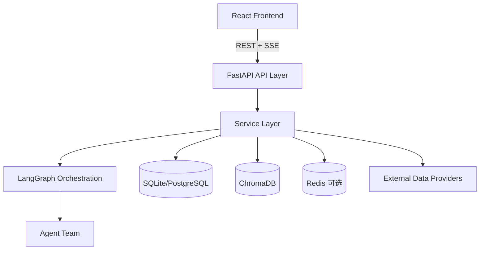

# 股票 Agents 监控大屏系统架构文档 (ARCH)

> 最后更新: 2026-02-11
> 基于仓库实况代码盘点（apps/client + apps/server）

## 1. 系统概述

本项目是一个以 **TradingAgents** 为核心的多 Agent 金融情报系统，采用 Monorepo 结构，支持 A 股 / 港股 / 美股分析。

- **后端**：FastAPI + LangGraph + SQLModel + ChromaDB + Redis(可选)
- **前端**：React 19 + Vite + TanStack Query + Tailwind + TradingView Lightweight Charts
- **协作模式**：分析师并行分析 → 多空辩论 → 风险评估 → 最终决策 + SSE 实时推送
- **认证体系**：JWT + OAuth2 + WebAuthn/Passkey

## 2. 当前规模（代码实况）

> 统计时间：2026-02-11

| 维度 | 当前值 |
|---|---:|
| 后端路由文件（不含 `__init__.py`） | 37 |
| API 端点处理器（`@router.*`） | 240 |
| 后端服务模块（不含 `__init__.py`） | 41 |
| Agent 实现文件（不含 `__init__.py`） | 34 |
| 后端测试文件（`test_*.py`） | 39 |
| 前端页面（`pages/*.tsx`） | 14 |
| 前端组件（`components/*.tsx`） | 44 |
| 前端 hooks（`hooks/*.ts`） | 26 |
| CI 工作流 | 4 |

## 3. 分层架构

### 3.1 前端层（`apps/client`）

- 路由入口：`index.tsx`
- 全局状态与请求：TanStack Query
- 实时分析：SSE 事件流消费（含重连与心跳超时）
- 业务页面：Dashboard、News、ChinaMarket、Macro、Portfolio、Prompts、Scheduler、AIConfig、Health、SupplyChain、Settings、Login、Register、NotFound

### 3.2 API 层（`apps/server/api/routes`）

路由按 4 个业务域聚合：

1. **analysis**（9）：`analyze`, `macro`, `sentiment`, `policy`, `reflection`, `model_racing`, `vision`, `supply_chain`, `central_bank`
2. **market**（8）：`market`, `north_money`, `lhb`, `jiejin`, `unlock`, `cross_asset`, `market_watcher`, `alternative`
3. **trading**（9）：`watchlist`, `portfolio`, `backtest`, `chat`, `memory`, `discover`, `news`, `news_aggregator`, `risk`
4. **system**（11）：`auth`, `oauth`, `passkey`, `health`, `admin`, `settings`, `prompts`, `ai_config`, `tts`, `subgraph_metrics`, `notifications`

### 3.3 服务层（`apps/server/services`）

- 已形成以 `data_router`, `synthesizer`, `memory_service`, `task_queue`, `cache_service`, `health_monitor`, `notification_service` 为核心的服务网。
- 调度与异步执行：`scheduler.py` + `workers/analysis_worker.py`。
- 数据可靠性：`data_validator.py` + 多数据源适配。

### 3.4 编排层（LangGraph）

- 主图：`tradingagents/graph/trading_graph.py`
- 子图：`analyst_subgraph.py` / `debate_subgraph.py` / `risk_subgraph.py`
- 运行模式：
  - 默认主图模式（monolith）
  - 子图灰度发布（由 rollout 逻辑决定）

## 4. 运行模式与关键数据流

### 4.1 分析执行模式

- **开发模式**：`BackgroundTasks`（默认）
- **生产模式**：`USE_TASK_QUEUE=true` 且配置 `REDIS_URL`，任务进入 Redis Stream，由 worker 消费

### 4.2 请求到结果的主路径

1. 前端 `POST /api/analyze/{symbol}` 创建任务
2. 后端入队（queue）或后台执行（background）
3. LangGraph 逐节点执行并写入 SSE 事件
4. `synthesizer` 合成结构化报告并落库
5. 前端订阅 `/api/analyze/stream/{task_id}` 实时渲染

## 5. 工程化与交付

- Monorepo 管理：`moon` + `pnpm` + `uv`
- CI：
  - 总流水线：`.github/workflows/ci.yml`
  - 后端：`.github/workflows/backend-ci.yml`
  - 前端：`.github/workflows/frontend-ci.yml`
  - 镜像：`.github/workflows/docker-build.yml`
- 容器编排：`docker-compose.yml`（backend + frontend + 可选 postgres/redis）

## 6. 当前已识别技术风险

1. **文档漂移风险**：历史文档中的统计数据与当前代码规模存在偏差（本次已校正主要文档）。
2. **路由重复定义风险**：`system/ai_config.py` 中存在重复端点定义（`/models` 与 `providers/{id}/test`）。
3. **类型同步风险**：前端类型生成脚本默认 OpenAPI 地址仍指向 `/api/v1/openapi.json`，而服务当前默认地址为 `/api/openapi.json`。
4. **回归风险**：关键链路有测试覆盖，但围绕 SSE、队列模式与子图灰度仍需提升集成验证强度。

## 7. 文档索引

- 产品需求：`docs/PRD.md`
- 运维手册：`docs/RUNBOOK.md`
- 贡献指南：`docs/CONTRIB.md`
- 迭代计划：`plans/next-iteration-plan.md`
