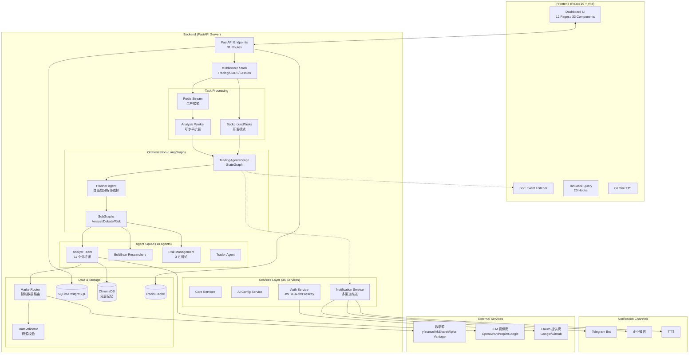
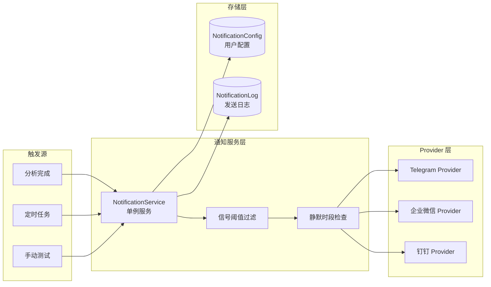

# 股票 Agents 监控大屏 系统架构文档 (ARCH.md)

> 最后更新: 2026-02-09

## 1. 系统概述

本项目是一个基于 **TradingAgents** 框架的专业级金融情报监控系统。它通过多 Agent 协作（Multi-Agent Orchestration）对全球股票市场（A股、港股、美股）进行深度分析，并以实时大屏的形式提供决策支持。

**核心特性**:
- 🤖 **多 Agent 协作**: 11 个分析师 + Bull/Bear 对抗辩论 + 三方风险评估
- 🌍 **多市场支持**: A股、港股、美股智能路由
- ⚡ **分级分析**: L1 快速扫描 (15-20s) / L2 深度研究 (30-60s)
- 🔐 **企业级认证**: JWT + OAuth 2.0 + WebAuthn/Passkey
- 📊 **实时可视化**: SSE 推送 + TradingView 图表
- 🔔 **智能推送**: 多渠道通知系统（Telegram/企业微信/钉钉）

## 2. 总体架构图



## 3. 核心分层设计

### 3.1 API 层 (FastAPI)

**31 个路由模块**，按功能域划分：

| 类别 | 路由 | 功能 |
|------|------|------|
| **核心分析** | `analyze` | Agent 分析触发 + SSE 流（L1/L2 分级） |
| | `watchlist` | 自选股 CRUD |
| | `market` | 实时行情 |
| | `discover` | Scout 股票发现 |
| | `portfolio` | 组合分析 |
| | `chat` | Fund Manager 对话 |
| **宏观与情绪** | `macro` | 宏观经济数据 |
| | `sentiment` | 情绪分析 |
| | `cross_asset` | 跨资产联动分析 |
| | `central_bank` | 央行 NLP 分析 |
| | `policy` | 政策-行业板块映射 |
| **A股特色** | `lhb` | 龙虎榜 |
| | `north_money` | 北向资金 |
| | `jiejin` | 限售解禁 |
| | `unlock` | 解禁管理 |
| **AI 配置** | `ai_config` | 动态 AI 提供商配置 |
| | `prompts` | Prompt 管理 |
| | `model_racing` | 模型竞赛评估 |
| **认证** | `auth` | JWT 认证 |
| | `oauth` | OAuth 2.0（Google/GitHub） |
| | `passkey` | WebAuthn 免密认证 |
| **通知** | `notifications` | 推送通知配置与日志 |
| **系统** | `health` | 系统健康 + 指标 |
| | `admin` | 管理接口（需 API Key） |
| | `settings` | 系统设置 |
| **其他** | `memory`, `reflection`, `news`, `news_aggregator`, `backtest`, `tts`, `market_watcher` |

**中间件栈**:
```python
RequestTracingMiddleware  # 请求追踪，注入 request_id
SessionMiddleware         # OAuth 2.0 状态存储
CORSMiddleware           # 跨域配置
```

### 3.2 任务处理层

支持两种模式：

| 模式 | 技术 | 并发能力 | 适用场景 |
|------|------|----------|----------|
| **开发模式** | FastAPI BackgroundTasks | 单进程限制 (~4) | 本地开发 |
| **生产模式** | Redis Stream + Worker | 水平无限扩展 | 生产部署 |

**Redis Stream 任务队列**:
```bash
# 启动多个 Worker 实现水平扩展
python -m workers.analysis_worker --name worker-1
python -m workers.analysis_worker --name worker-2
python -m workers.analysis_worker --name worker-3
```

配置: `USE_TASK_QUEUE=true` + `REDIS_URL=redis://localhost:6379`

### 3.3 编排层 (LangGraph)

**分析分级 (L1/L2)**:

| 级别 | 内容 | 分析师 | 辩论 | 耗时 | API |
|------|------|--------|------|------|-----|
| **L1 Quick** | 快速扫描 | Market + News + Macro | ❌ 无 | 15-20s | `POST /api/analyze/quick/{symbol}` |
| **L2 Full** | 深度研究 | 全部 + Planner 自适应 | ✅ 完整 | 30-60s | `POST /api/analyze/{symbol}` |

**SubGraph 架构（实验性）**:
```
MainGraph
  ├─ Planner Node ─────────────────→ 自适应选择分析师
  │     ↓
  ├─ AnalystSubGraph ─────────────→ 并行执行选中的分析师
  │     ├─ private state: _analyst_errors, _analyst_completed
  │     └─ output: market_report, news_report, ...
  │     ↓
  ├─ Trader Node
  │     ↓
  ├─ DebateSubGraph ──────────────→ Bull vs Bear 多轮辩论
  │     ├─ private state: investment_debate_state
  │     └─ output: investment_plan
  │     ↓
  ├─ RiskSubGraph ────────────────→ 三方风险辩论
  │     ├─ private state: risk_debate_state
  │     └─ output: final_trade_decision
  │     ↓
  └─ Portfolio Agent
```

通过 `use_subgraphs=True` 启用（默认关闭）。

### 3.4 Agent 团队 (18 Agents)

**分析师团队 (11)**:

| Agent | 职责 | 数据源 |
|-------|------|--------|
| `market_analyst` | K 线形态、技术指标 | yfinance/AkShare |
| `fundamentals_analyst` | 财报解析、估值模型 | Alpha Vantage/AkShare |
| `news_analyst` | 新闻舆情分析 | Alpha Vantage/Google News |
| `social_media_analyst` | Reddit/Twitter 热度 | Reddit API |
| `macro_analyst` | 宏观经济环境 | FRED/AkShare |
| `sentiment_agent` | 市场情绪量化 | 多源聚合 |
| `policy_agent` | 政策-行业映射 | 央行公告/政府文件 |
| `fund_flow_agent` | 资金流向追踪 | AkShare 龙虎榜/北向 |
| `portfolio_agent` | 组合相关性分析 | 计算引擎 |
| `scout_agent` | 股票发现 | DuckDuckGo/Google |
| **`planner_agent`** | **自适应分析师选择** | 元数据 |

**Planner 核心能力**:
```python
# 根据股票特征动态选择分析师
if volume < threshold:
    skip("fund_flow")  # 低成交量跳过资金流向
if is_earnings_season:
    activate("fundamentals")  # 财报季激活基本面
if news_spike:
    activate("news", "social")  # 新闻爆发激活舆情
if market == "CN":
    activate("sentiment", "policy", "fund_flow")  # A股特色分析师
```

**研究员与风险团队**:

| 类别 | Agents | 职责 |
|------|--------|------|
| Researchers | bull_researcher, bear_researcher | 多空对抗辩论 |
| Managers | research_manager, risk_manager | 辩论裁决、风险评估 |
| Risk Debaters | aggressive, conservative, neutral | 三方风险辩论 |
| Trader | trader | 最终决策合成 |

### 3.5 数据路由层 (MarketRouter)

**智能路由规则**:

| Symbol 模式 | 市场 | 主数据源 | 降级数据源 |
|-------------|------|----------|------------|
| `\d{6}\.(SH\|SZ)` | A股 | AkShare | yfinance |
| `\d{5}\.HK` | 港股 | yfinance | AkShare |
| 其他 | 美股 | yfinance | Alpha Vantage |

**数据源映射表**:

| 数据项 | A股 (CN) | 港股 (HK) | 美股 (US) |
|--------|----------|-----------|-----------|
| 实时价格 | AkShare `stock_zh_a_spot_em` | yfinance | yfinance |
| 历史 K 线 | AkShare `stock_zh_a_hist` | yfinance | yfinance |
| 技术指标 | stockstats (计算) | stockstats | yfinance/stockstats |
| 财务报表 | AkShare `stock_financial_report_sina` | yfinance | Alpha Vantage |
| 新闻 | AkShare/东方财富 | Google News | Alpha Vantage |
| 龙虎榜 | AkShare `stock_lhb_*` | ❌ | ❌ |
| 北向资金 | AkShare `stock_hsgt_*` | ❌ | ❌ |

**数据质量校验 (DataValidator)**:

跨数据源校验，低质量数据标记注入 Agent prompt：
```
⚠️ 数据质量提示 (AAPL):
整体质量: medium
存在显著偏差的字段: pe_ratio, eps
  - pe_ratio: yfinance=25.3, alpha_vantage=28.1 (偏差 10.5%, 阈值 15%)
数据源: yfinance (主) / alpha_vantage (备)
请在分析中考虑数据可靠性。
```

### 3.6 数据合成与对齐 (Synthesis)

`ResponseSynthesizer` 将 Agent Markdown 报告转换为前端 JSON：

1. **输入**: `AgentState` 中的所有原始报告（Markdown）
2. **处理**:
   - Few-shot Prompting: 提供示例确保复杂嵌套结构正确
   - Schema Enforcement: 使用 Pydantic 生成输出规范
   - 主播稿生成: TTS 优化的口播文本
3. **输出**: 严格符合前端 `types.ts` 的 `AgentAnalysis` JSON

### 3.7 存储与配置层

**SQL 数据库 Schema**:

| 表 | 字段 | 用途 |
|----|------|------|
| `Watchlist` | id, symbol, name, market, added_at | 自选股 |
| `AnalysisResult` | id, symbol, date, signal, confidence, full_report_json, anchor_script, created_at | 分析结果 |
| `ChatHistory` | id, thread_id, role, content, created_at | 对话历史 |
| `User` | id, username, email, hashed_password, oauth_provider, passkey_credential | 用户 |
| `AIProvider` | id, name, type, base_url, api_key_encrypted, is_enabled | AI 提供商 |
| `NotificationConfig` | id, user_id, channel, channel_user_id, is_enabled, signal_threshold, quiet_hours_start, quiet_hours_end | 通知配置 |
| `NotificationLog` | id, user_id, channel, title, body, signal, symbol, sent_at, delivered, error | 通知日志 |

**向量数据库 (ChromaDB) 分层记忆**:

| Collection | 检索维度 | 用途 |
|------------|----------|------|
| `analysis_history` | symbol | 按股票检索历史分析 |
| `macro_cycles` | macro_cycle | 按宏观周期检索（如 rate_cut） |
| `pattern_cases` | pattern_type + sector | 按技术形态检索（如 double_bottom） |

**Embedding 元数据**:
```python
metadata = {
    "symbol": "AAPL",
    "date": "2026-02-02",
    "signal": "Strong Buy",
    "confidence": 85,
    "macro_cycle": "rate_cut",
    "pattern_type": "double_bottom",
    "sector": "tech",
    "outcome": "correct",
    "return_5d_pct": 4.2,
}
```

## 4. API 接口定义

### 4.1 分析接口

| 方法 | 端点 | 功能 | 参数 |
|------|------|------|------|
| POST | `/api/analyze/{symbol}` | L2 完整分析 | `analysis_level`, `use_planner` |
| POST | `/api/analyze/quick/{symbol}` | L1 快速扫描 | - |
| GET | `/api/analyze/stream/{task_id}` | SSE 实时进度 | - |
| GET | `/api/analyze/latest/{symbol}` | 最近一次结果 | - |
| GET | `/api/analyze/status/{task_id}` | 任务状态 | - |

**SSE 事件格式**:
```json
{
  "event": "stage_analyst",
  "data": {
    "status": "completed",
    "message": "Market analyst completed",
    "payload": { "market_report": "..." }
  }
}
```

事件序列: `stage_analyst` → `stage_debate` → `stage_risk` → `stage_final`

### 4.2 AI 配置接口

| 方法 | 端点 | 功能 |
|------|------|------|
| GET | `/api/ai/providers` | 列出所有提供商 |
| POST | `/api/ai/providers` | 创建提供商 |
| PUT | `/api/ai/providers/{id}` | 更新提供商 |
| DELETE | `/api/ai/providers/{id}` | 删除提供商 |
| POST | `/api/ai/providers/{id}/test` | 测试连接 |
| GET | `/api/ai/models` | 获取模型配置 |
| PUT | `/api/ai/models/{key}` | 更新模型配置 |
| GET | `/api/ai/status` | 获取配置状态 |

### 4.3 认证接口

| 方法 | 端点 | 功能 |
|------|------|------|
| POST | `/api/auth/register` | 用户注册 |
| POST | `/api/auth/login` | JWT 登录 |
| POST | `/api/auth/refresh` | 刷新 Token |
| GET | `/api/oauth/google` | Google OAuth 跳转 |
| GET | `/api/oauth/google/callback` | Google OAuth 回调 |
| GET | `/api/oauth/github` | GitHub OAuth 跳转 |
| POST | `/api/passkey/register/begin` | Passkey 注册开始 |
| POST | `/api/passkey/register/complete` | Passkey 注册完成 |
| POST | `/api/passkey/authenticate/begin` | Passkey 认证开始 |
| POST | `/api/passkey/authenticate/complete` | Passkey 认证完成 |

### 4.4 通知接口

| 方法 | 端点 | 功能 |
|------|------|------|
| GET | `/api/notifications/config` | 获取当前用户的通知配置列表 |
| PUT | `/api/notifications/config` | 创建或更新通知配置 |
| DELETE | `/api/notifications/config/{channel}` | 删除指定渠道的通知配置 |
| GET | `/api/notifications/logs` | 获取通知发送日志（支持 limit 参数） |
| POST | `/api/notifications/test` | 发送测试通知 |

**通知配置参数**:
```json
{
  "channel": "telegram",
  "channel_user_id": "123456789",
  "is_enabled": true,
  "signal_threshold": "STRONG_BUY",  // STRONG_BUY | BUY | ALL
  "quiet_hours_start": 22,           // 0-23, 可选
  "quiet_hours_end": 8               // 0-23, 可选
}
```

### 4.5 健康检查接口

| 方法 | 端点 | 功能 |
|------|------|------|
| GET | `/api/health/` | 快速健康探针 |
| GET | `/api/health/report` | 详细健康报告 |
| GET | `/api/health/components` | 组件状态 |
| GET | `/api/health/metrics` | 系统指标 (CPU/内存/磁盘) |
| GET | `/api/health/api-metrics` | API 性能指标 |
| GET | `/api/health/liveness` | K8s 存活探针 |
| GET | `/api/health/readiness` | K8s 就绪探针 |

## 5. 前后端 JSON 合约

`AgentAnalysis` 是核心数据合约（前端 `types.ts` 801 行定义）：

```typescript
interface AgentAnalysis {
  symbol: string;
  timestamp: string;
  signal: SignalType;  // STRONG_BUY | BUY | HOLD | SELL | STRONG_SELL
  confidence: number;  // 0-100
  reasoning: string;
  anchor_script: string;  // TTS 优化主播稿

  debate: {
    bull: { thesis: string; points: DebatePoint[] };
    bear: { thesis: string; points: DebatePoint[] };
    winner: "Bull" | "Bear";
    conclusion: string;
  };

  riskAssessment: {
    score: number;  // 0-10
    volatilityStatus: "Low" | "Moderate" | "High";
    liquidityConcerns: boolean;
    maxDrawdownRisk: string;
    verdict: "Approved" | "Rejected" | "Conditional";
  };

  technicalIndicators: {
    rsi: number;
    macd: string;
    trend: "Bullish" | "Bearish" | "Neutral";
  };

  tradeSetup: {
    entryZone: string;
    targetPrice: number;
    stopLossPrice: number;
    rewardToRiskRatio: number;
  };

  newsAnalysis: NewsItem[];
  macroContext?: MacroContext;
}
```

## 6. 认证与安全

### 6.1 认证方式

| 方式 | 技术 | 适用场景 |
|------|------|----------|
| **JWT** | python-jose + passlib | 用户名/密码登录 |
| **OAuth 2.0** | authlib | Google/GitHub 第三方登录 |
| **WebAuthn** | webauthn + FIDO2 | 免密生物识别认证 |

### 6.2 安全特性

- **API Key 保护**: 敏感 Key 仅在后端环境变量中存储
- **CORS 配置**: 严格限制前端来源
- **AI 密钥加密**: 使用 Fernet 对称加密存储
- **请求追踪**: 每个请求注入唯一 `request_id`
- **结构化日志**: JSON 格式 + ISO 时间戳

## 7. 通知系统架构

### 7.1 系统概述

通知系统支持多渠道推送（Telegram、企业微信、钉钉），具备信号阈值过滤、静默时段管理和发送日志追踪功能。

### 7.2 架构设计



### 7.3 核心组件

**NotificationService** (单例模式):
- 管理多个 Provider 实例
- 信号阈值过滤逻辑
- 静默时段检查（支持跨午夜）
- 发送日志记录

**NotificationProvider** (抽象基类):
```python
class NotificationProvider(ABC):
    @abstractmethod
    async def send(self, channel_user_id: str, title: str, body: str) -> bool:
        """发送通知，返回是否成功"""
        ...
```

**已实现的 Provider**:
- `TelegramProvider`: Telegram Bot API 推送

**计划中的 Provider**:
- `WeChatProvider`: 企业微信应用消息
- `DingTalkProvider`: 钉钉机器人

### 7.4 信号阈值过滤

**信号优先级映射**:
```python
SIGNAL_PRIORITY = {
    "STRONG_BUY": 5,
    "STRONG_SELL": 5,
    "BUY": 4,
    "SELL": 4,
    "HOLD": 3,
}
```

**阈值配置**:
- `STRONG_BUY`: 仅推送 STRONG_BUY/STRONG_SELL 信号
- `BUY`: 推送 BUY/SELL 及以上信号
- `ALL`: 推送所有信号（包括 HOLD）

### 7.5 静默时段

支持配置静默时段（如 22:00-08:00），在此期间不发送通知。

**跨午夜支持**:
```python
# 示例：22:00-08:00
if start <= end:
    # 不跨午夜：如 09:00-18:00
    return start <= current_hour < end
else:
    # 跨午夜：如 22:00-08:00
    return current_hour >= start or current_hour < end
```

### 7.6 触发场景

| 场景 | 触发点 | 代码位置 |
|------|--------|----------|
| 分析完成 | Agent 分析结束后 | `api/routes/analysis/analyze.py` |
| 定时分析 | 每日自动分析完成 | `services/scheduler.py` |
| 手动测试 | 用户点击测试按钮 | `api/routes/system/notifications.py` |

### 7.7 数据流

```
用户配置通知 → NotificationConfig 表
    ↓
分析完成触发 → NotificationService.notify_analysis_complete()
    ↓
查询启用的配置 → 过滤信号阈值 → 检查静默时段
    ↓
调用 Provider.send() → Telegram Bot API
    ↓
记录发送日志 → NotificationLog 表
    ↓
前端查询日志 → GET /api/notifications/logs
```

### 7.8 Telegram Bot 配置

**1. 创建 Bot**:
- 与 [@BotFather](https://t.me/BotFather) 对话
- 发送 `/newbot` 并按提示操作
- 获取 Bot Token（格式：`123456:ABC-DEF1234ghIkl-zyx57W2v1u123ew11`）

**2. 获取 Chat ID**:
- 与你的 Bot 对话，发送任意消息
- 访问 `https://api.telegram.org/bot<YOUR_BOT_TOKEN>/getUpdates`
- 在返回的 JSON 中找到 `message.chat.id`

**3. 配置环境变量**:
```bash
TELEGRAM_BOT_TOKEN=123456:ABC-DEF1234ghIkl-zyx57W2v1u123ew11
TELEGRAM_API_BASE=https://api.telegram.org  # 可选，默认值
```

**4. 前端配置**:
- 登录系统 → 设置页面 → 通知配置
- 输入 Chat ID
- 选择信号阈值和静默时段
- 点击"测试通知"验证配置

## 8. 部署方案

### 8.1 Docker Compose

```yaml
services:
  backend:
    image: stock-agents-backend
    ports: ["8000:8000"]
    volumes:
      - ./data/db:/app/db
      - ./data/chroma:/app/db/chroma
    healthcheck:
      test: ["CMD", "curl", "-f", "http://localhost:8000/health"]

  frontend:
    image: stock-agents-frontend
    ports: ["3000:80"]
    depends_on: [backend]

  postgres:  # 可选
    image: postgres:15-alpine
    profiles: [postgresql]

  redis:  # 可选
    image: redis:7-alpine
    profiles: [cache]
```

### 8.2 生产环境配置

```bash
# 启用 PostgreSQL
DATABASE_MODE=postgresql
POSTGRES_PASSWORD=secure_password

# 启用 Redis 缓存和任务队列
REDIS_URL=redis://localhost:6379
USE_TASK_QUEUE=true

# 启动多个 Worker
python -m workers.analysis_worker --name worker-1 &
python -m workers.analysis_worker --name worker-2 &
```

### 8.3 Kubernetes 探针

```yaml
livenessProbe:
  httpGet:
    path: /api/health/liveness
    port: 8000
  initialDelaySeconds: 10
  periodSeconds: 30

readinessProbe:
  httpGet:
    path: /api/health/readiness
    port: 8000
  initialDelaySeconds: 5
  periodSeconds: 10
```

## 9. 可观测性

### 9.1 日志格式

```json
{
  "timestamp": "2026-02-02T10:30:45.123456+00:00",
  "request_id": "550e8400-e29b-41d4-a716-446655440000",
  "level": "info",
  "event": "Request completed",
  "method": "GET",
  "path": "/api/analyze/latest/AAPL",
  "status_code": 200,
  "duration_ms": 45.2
}
```

### 9.2 LangSmith 追踪

```bash
LANGSMITH_ENABLED=true
LANGSMITH_API_KEY=...
LANGSMITH_PROJECT=stock-agents
LANGSMITH_TRACE_SAMPLING_RATE=1.0
```

### 9.3 健康指标

| 指标 | 警告阈值 | 严重阈值 |
|------|----------|----------|
| CPU 使用率 | > 70% | > 90% |
| 内存使用率 | > 80% | > 95% |
| 磁盘使用率 | > 80% | > 95% |
| API 错误率 | > 1% | > 5% |
| 平均响应时间 | > 500ms | > 2000ms |

## 10. 目录结构

```
apps/server/
├── api/
│   ├── routes/         # 31 个业务路由
│   ├── dependencies.py # 依赖注入
│   ├── middleware.py   # 中间件
│   ├── exceptions.py   # 自定义异常
│   └── sse.py          # SSE 封装
├── services/           # 35 个服务模块
├── workers/
│   └── analysis_worker.py  # Redis Stream Worker
├── config/
│   ├── settings.py     # Pydantic Settings
│   ├── oauth.py        # OAuth 配置
│   └── prompts.yaml    # Agent Prompt 注册表
├── db/
│   └── models.py       # SQLModel ORM
├── tradingagents/
│   ├── graph/
│   │   ├── setup.py    # 图构建
│   │   ├── trading_graph.py
│   │   └── subgraphs/  # SubGraph 模块
│   ├── agents/
│   │   ├── analysts/   # 11 个分析师
│   │   ├── researchers/
│   │   ├── managers/
│   │   ├── risk_mgmt/
│   │   ├── trader/
│   │   └── utils/      # 工具集
│   └── dataflows/      # 数据源适配器
└── main.py             # 服务入口
```

## 11. 依赖清单

### 后端核心 (56+)

| 类别 | 包 |
|------|---|
| Web | fastapi, uvicorn, sse-starlette |
| 数据 | pandas, yfinance, akshare, tushare, alpha-vantage, finnhub-python, fredapi |
| LLM | langchain-openai, langchain-anthropic, langchain-google-genai, langgraph |
| 数据库 | sqlmodel, chromadb, redis |
| 认证 | python-jose, passlib, authlib, webauthn |
| 工具 | pyyaml, structlog, httpx, apscheduler |

### 前端核心 (10)

| 类别 | 包 |
|------|---|
| 框架 | react@19, react-dom, react-router-dom@7 |
| 状态 | @tanstack/react-query |
| UI | lucide-react, framer-motion |
| 图表 | recharts, lightweight-charts |
| AI | @google/genai |
| 认证 | @simplewebauthn/browser |
