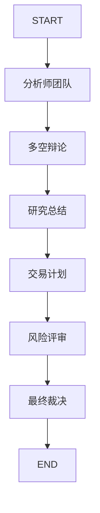

# TradingAgents 技术架构详解

本文档深入探讨 **TradingAgents** 的内部架构、核心组件及其交互逻辑。

---

## 1. 整体架构 (System Overview)

TradingAgents 采用分层架构设计，确保了研究逻辑与执行逻辑的解耦：

- **应用层 (FastAPI)**: 提供 RESTful API、SSE 流式推送及 WebSocket 交互。
- **编排层 (LangGraph)**: 核心决策引擎，管理多智能体协作的状态机。
- **逻辑层 (Agents & Tools)**: 定义具体的智能体行为及其可调用的金融工具。
- **数据层 (Dataflows)**: 统一的数据接入层，支持多供应商路由与回退。
- **持久化层 (PostgreSQL & Redis)**: 存储会话状态、交易记录及缓存数据。

---

## 2. 智能体工作流 (LangGraph Workflow)

系统通过 `StateGraph` 定义了一个严密的决策链，每个节点代表一个智能体或工具：

### 流程图

### 核心状态对象 (`AgentState`)
所有智能体共享一个状态对象，包含：
- `ticker`: 当前分析的股票代码。
- `reports`: 各阶段生成的分析报告。
- `debate_history`: 研究员之间的辩论记录。
- `final_decision`: 最终的交易指令（BUY/SELL/HOLD）。

---

## 3. 插件系统 (Plugin System)

### Vendor Plugins
通过 `DataVendorPlugin` 基类，开发者可以轻松接入新的行情或新闻源。系统支持：
- **动态路由**: 根据配置决定使用哪个供应商。
- **自动回退**: 当主供应商触发频率限制时，自动切换到备用源。

### Agent Plugins
支持动态加载 Agent 逻辑，允许在不修改核心代码的情况下调整智能体的 Prompt 或决策算法。

---

## 4. 流式响应架构 (Streaming)

为了提供极致的用户体验，系统实现了全链路流式响应：
1. **后端**: `SessionEventManager` 捕获 LangGraph 的节点事件。
2. **传输**: 通过 Redis Pub/Sub 将事件分发到 FastAPI 进程。
3. **前端**: 使用 SSE (Server-Sent Events) 实时渲染智能体的思考过程。

---

## 5. 数据库模型

- **`AnalysisSession`**: 记录单次分析的完整上下文。
- **`Trade` & `Position`**: 跟踪实盘或模拟交易的执行情况。
- **`AgentLLMConfig`**: 存储每个智能体的个性化 LLM 配置。

---
*本文档由 Architect 模式自动生成，最后更新日期：2026-01-14*