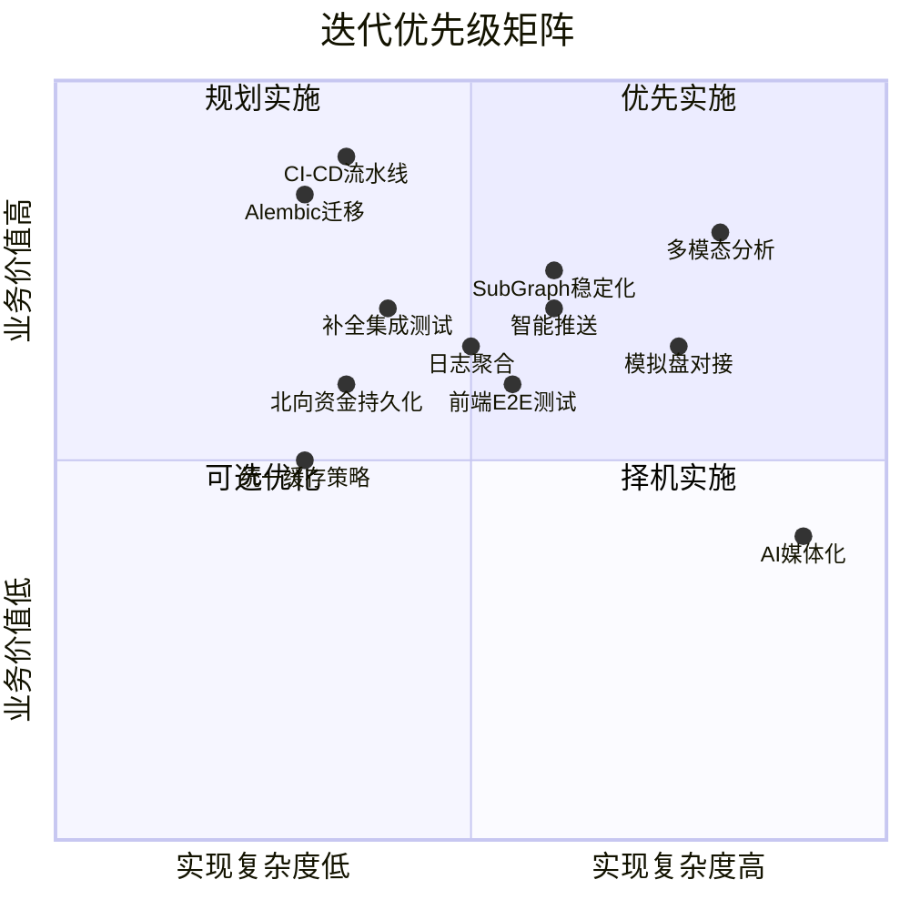
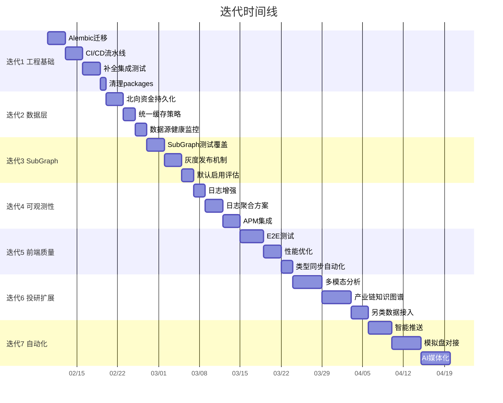

# HeavenlyMechanicPavilion 迭代计划

> 生成时间: 2026-02-06
> 基于实际代码审查制定

---

## 当前状态评估

### 已完成且代码质量良好的模块
- ✅ **核心 Agent 编排**: `TradingAgentsGraph` + LangGraph StateGraph 完整实现
- ✅ **18 个 Agent**: 分析师/辩论/风控/交易全链路
- ✅ **数据路由**: `MarketRouter` 多市场智能路由 + 降级 + 熔断
- ✅ **任务队列**: Redis Stream + 内存双模式，含 DLQ 和重试
- ✅ **缓存服务**: Redis/内存双后端，抽象接口设计良好
- ✅ **认证体系**: JWT + OAuth 2.0 + WebAuthn 三重认证
- ✅ **记忆系统**: ChromaDB 分层记忆 + 时间衰减 + 组合评分 (1127 行)
- ✅ **弹性机制**: Agent 超时/降级/重试/监控
- ✅ **AkShare 鲁棒封装**: 重试/熔断/限流
- ✅ **前端 12 页面 + 33 组件 + 20 Hooks**: 完整 SPA
- ✅ **单元测试**: 22 个测试文件覆盖核心服务

### 已识别的技术债务和半成品

| 问题 | 位置 | 严重程度 |
|------|------|----------|
| `packages/` 共享包目录为空壳 | `packages/backend/`, `packages/frontend/` | 低 |
| SubGraph 架构默认关闭 | `use_subgraphs=False` | 中 |
| 北向资金历史数据未持久化 | `north_money_service.py:609` TODO | 中 |
| 北向资金-指数相关性为占位数据 | `north_money_service.py:847` TODO | 中 |
| 集成测试 SSE 部分为空 | `test_analyze_api.py:284` TODO | 中 |
| 集成测试 mock 不完整 | `test_analyze_api.py:296` TODO | 中 |
| 无数据库迁移工具 | 全局 | 高 |
| 无前端 E2E 测试 | `apps/client/` | 中 |
| `data_router.py` 使用模块级内存缓存 | `data_router.py:19-27` | 低 |
| 无 CI/CD 配置 | `.github/` 目录存在但内容未知 | 高 |
| 无日志聚合方案 | 全局 | 中 |

---

## 迭代计划

### 迭代 1: 工程基础加固

**目标**: 补齐工程化短板，确保可持续迭代

1. **集成 Alembic 数据库迁移**
   - 在 `apps/server/` 下初始化 Alembic
   - 为现有 SQLModel 模型生成初始迁移脚本
   - 更新 `main.py` 生命周期管理，启动时自动检查迁移

2. **完善 CI/CD 流水线**
   - 检查并补全 `.github/workflows/` 配置
   - 后端: lint (ruff) + type check (mypy) + pytest
   - 前端: lint (eslint) + type check (tsc) + build
   - Docker 镜像构建和推送

3. **补全集成测试**
   - 实现 `test_analyze_api.py` 中的 SSE 流测试 (mock cache_service)
   - 实现完整的分析触发 mock 集成测试
   - 添加认证流程集成测试

4. **清理 packages/ 空壳目录**
   - 评估是否需要共享包机制
   - 如不需要则移除空目录，简化 Moon 配置

### 迭代 2: 数据层完善

**目标**: 补齐数据持久化和质量短板

5. **北向资金历史数据持久化**
   - 设计 `NorthMoneyHistory` 数据库模型
   - 实现历史数据存储和查询 API
   - 实现北向资金-指数相关性计算（替换占位数据）

6. **统一缓存策略**
   - 将 `data_router.py` 模块级内存缓存迁移到 `cache_service`
   - 统一缓存 key 命名规范
   - 添加缓存命中率监控

7. **数据源健康监控仪表盘**
   - 在 `/api/health/report` 中增加数据源状态
   - 展示各数据源的熔断状态、失败率、延迟

### 迭代 3: SubGraph 架构稳定化

**目标**: 将实验性 SubGraph 架构推向生产就绪

8. **SubGraph 架构测试覆盖**
   - 为 `analyst_subgraph.py`, `debate_subgraph.py`, `risk_subgraph.py` 编写单元测试
   - 对比 SubGraph 模式与传统模式的分析结果一致性

9. **SubGraph 灰度发布机制**
   - 实现 A/B 测试框架：按用户/请求比例路由到 SubGraph 模式
   - 收集两种模式的性能和质量指标

10. **SubGraph 默认启用**
    - 基于灰度数据决策是否将 `use_subgraphs` 默认改为 `True`
    - 更新文档和配置

### 迭代 4: 可观测性提升

**目标**: 建立完整的可观测性体系

11. **结构化日志增强**
    - 统一日志格式，确保所有服务使用 structlog
    - 添加 correlation_id 跨服务追踪
    - 配置日志级别动态调整 API

12. **日志聚合方案**
    - 集成 Loki + Grafana 或 ELK Stack
    - 配置 Docker Compose profile 一键启动
    - 创建关键业务仪表盘

13. **APM 集成**
    - 评估 OpenTelemetry 集成方案
    - 为关键路径添加 Span（分析任务全链路）
    - LangSmith 与 APM 数据关联

### 迭代 5: 前端质量提升

**目标**: 提升前端代码质量和测试覆盖

14. **前端 E2E 测试**
    - 集成 Playwright
    - 覆盖核心流程：登录 → 添加自选 → 触发分析 → 查看结果
    - 集成到 CI/CD

15. **前端性能优化**
    - 分析 bundle size，优化代码分割
    - 图表组件懒加载优化
    - SSE 重连机制健壮性测试

16. **OpenAPI 类型同步自动化**
    - 将 `gen:types` 脚本集成到 CI
    - 确保前后端类型始终同步
    - 添加类型不一致检测

### 迭代 6: 深度投研能力扩展

**目标**: 扩展分析能力边界

17. **多模态分析**
    - 财报图表 Vision 识别（GPT-4V / Gemini Vision）
    - 电话会录音转录 + 语义分析

18. **产业链知识图谱**
    - 设计供应链关系数据模型
    - 实现产业链穿透分析 Agent

19. **另类数据接入**
    - 专利监控数据源
    - AH 溢价套利信号

### 迭代 7: 自动化与智能推送

**目标**: 从分析到执行的闭环

20. **智能推送系统**
    - Telegram Bot 集成
    - 微信机器人推送
    - 基于信号强度的推送策略

21. **模拟盘对接**
    - 设计 ExecutionAgent 接口
    - 对接模拟交易 API
    - 实现纸上交易记录和绩效追踪

22. **AI 媒体化**
    - 双人对话播客生成
    - 数字人视频简报（评估可行性）

---

## 迭代优先级矩阵

## 迭代时间线

---

## 关键决策点

| 决策 | 时机 | 选项 |
|------|------|------|
| 是否保留 `packages/` 共享包 | 迭代 1 | 保留并实现 / 移除 |
| SubGraph 是否默认启用 | 迭代 3 结束 | 基于灰度数据决策 |
| 日志聚合选型 | 迭代 4 开始 | Loki+Grafana / ELK / 云服务 |
| APM 选型 | 迭代 4 | OpenTelemetry / Datadog / 自建 |
| 模拟盘 API 选型 | 迭代 7 | 自建 / 第三方 API |
