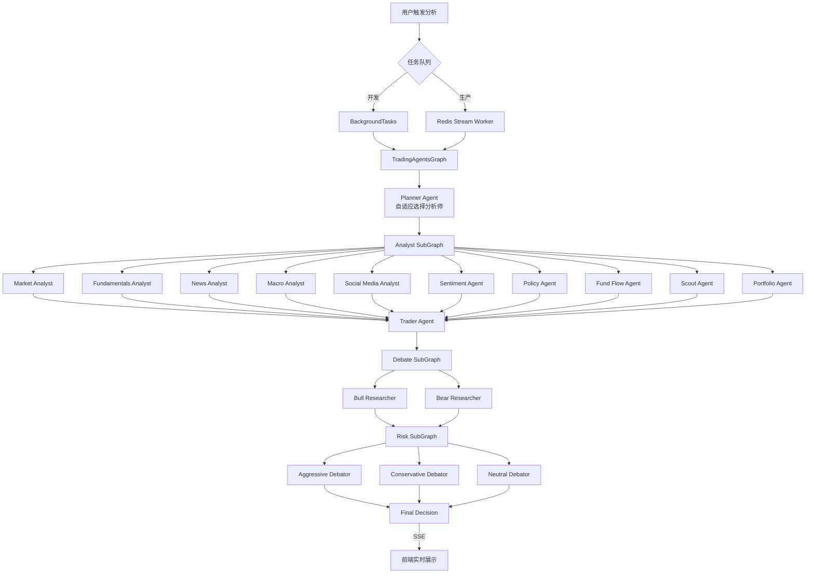
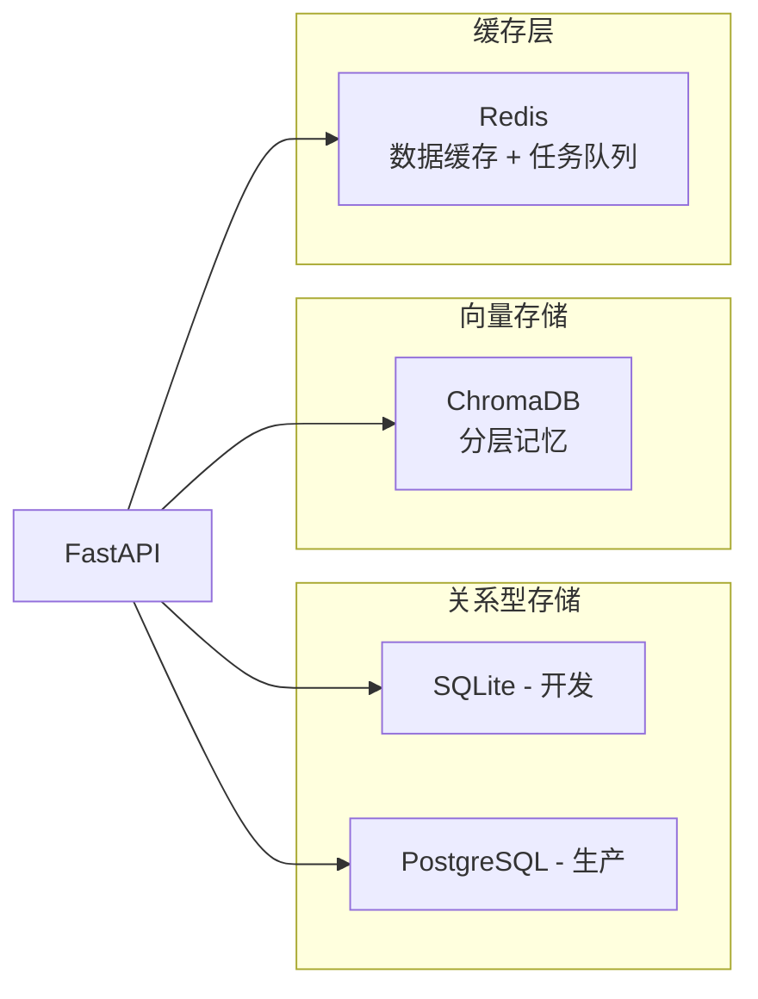
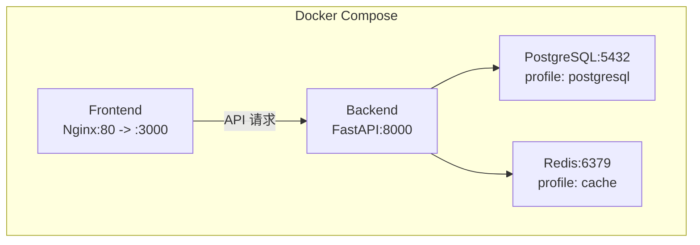

# HeavenlyMechanicPavilion（天机阁）项目梳理

> 生成时间: 2026-02-06

## 1. 项目定位

**Stock Agents Monitor** — 基于 [TradingAgents 论文](https://arxiv.org/abs/2412.20138) 的专业级金融情报监控系统。通过 18 个 AI Agent 多角色协作（分析师团队 + Bull/Bear 对抗辩论 + 三方风险评估），对 A股/港股/美股 进行深度分析，以交易室监控大屏形式提供投资决策支持。

**项目规模**: ~40,000 行代码 | 31 路由 | 34 服务 | 18 Agent | 12 页面 | 33 组件 | 20 Hooks

---

## 2. Monorepo 结构

```
HeavenlyMechanicPavilion/
├── .moon/                    # Moon 工作区管理
├── apps/
│   ├── client/               # 前端 - React 19 + Vite + Tailwind CSS
│   └── server/               # 后端 - Python 3.10 + FastAPI + LangGraph
├── packages/                 # 共享包（目前为空壳目录）
│   ├── backend/              # 预留后端共享包
│   └── frontend/             # 预留前端共享包
├── docs/                     # 项目文档
│   ├── ARCH.md               # 系统架构文档
│   ├── PRD.md                # 产品需求文档
│   ├── CONTRIB.md            # 贡献指南
│   └── RUNBOOK.md            # 运维手册
├── plans/                    # 规划文档
├── docker-compose.yml        # Docker 编排
├── CLAUDE.md                 # AI 编码指引
└── IMPLEMENTATION_SUMMARY.md # 实施总结
```

---

## 3. 技术栈总览

```mermaid
graph LR
    subgraph Frontend
        React19[React 19]
        Vite[Vite 6]
        TailwindCSS[Tailwind CSS]
        TanStack[TanStack Query]
        TradingView[TradingView Charts]
        Recharts[Recharts]
        FramerMotion[Framer Motion]
        WebAuthn[@simplewebauthn/browser]
    end

    subgraph Backend
        FastAPI[FastAPI]
        LangGraph[LangGraph StateGraph]
        SQLModel[SQLModel ORM]
        ChromaDB[ChromaDB 向量库]
        Redis[Redis Stream]
        APScheduler[APScheduler]
        LangSmith[LangSmith Tracing]
    end

    subgraph External
        OpenAI[OpenAI]
        Anthropic[Anthropic]
        Google[Google Gemini]
        yfinance[yfinance]
        AkShare[AkShare]
        AlphaVantage[Alpha Vantage]
        DuckDuckGo[DuckDuckGo]
    end

    Frontend -->|REST + SSE| Backend
    Backend --> External
```

| 层级 | 技术选型 |
|------|----------|
| **前端框架** | React 19 + Vite 6 + TypeScript 5.8 (strict) |
| **UI/样式** | Tailwind CSS + Framer Motion |
| **状态管理** | TanStack Query v5 (20 hooks) |
| **图表** | TradingView Lightweight Charts + Recharts |
| **认证** | @simplewebauthn/browser |
| **后端框架** | FastAPI + Uvicorn |
| **AI 编排** | LangGraph (StateGraph + SubGraph) |
| **LLM** | OpenAI / Anthropic / Google Gemini (动态切换) |
| **数据库** | SQLite/PostgreSQL (SQLModel) + ChromaDB (向量) |
| **缓存/队列** | Redis (缓存 + Stream 任务队列) |
| **数据源** | yfinance / AkShare / Alpha Vantage / DuckDuckGo |
| **可观测** | LangSmith + structlog + 健康探针 |
| **部署** | Docker Compose |
| **包管理** | pnpm (前端) + uv (后端) + Moon (monorepo) |

---

## 4. 后端架构详解

### 4.1 目录结构

```
apps/server/
├── main.py                   # 应用入口
├── api/
│   ├── routes/               # 31 个路由模块（按域分组）
│   │   ├── analysis/         # 核心分析: analyze, macro, sentiment, policy...
│   │   ├── market/           # 市场数据: market, lhb, north_money, jiejin...
│   │   ├── system/           # 系统管理: auth, oauth, passkey, health, admin...
│   │   └── trading/          # 交易相关: watchlist, portfolio, chat, discover...
│   ├── schemas/              # Pydantic 请求/响应模型
│   ├── dependencies.py       # FastAPI 依赖注入
│   ├── exceptions.py         # 异常处理
│   ├── middleware.py         # 请求追踪中间件
│   └── sse.py                # SSE 事件流封装
├── services/                 # 34 个业务服务
├── workers/                  # Redis Stream Worker
├── config/                   # 配置管理
│   ├── settings.py           # Pydantic Settings
│   ├── oauth.py              # OAuth 2.0 配置
│   └── prompts.yaml          # Agent Prompt 注册表
├── db/                       # 数据库 ORM
├── tests/                    # 测试套件
│   ├── unit/                 # 单元测试 (20+ 文件)
│   ├── integration/          # 集成测试
│   └── fixtures/             # 测试 fixtures
└── tradingagents/            # 核心 AI Agent 框架
    ├── agents/               # 18 个 Agent 实现
    │   ├── analysts/         # 11 个分析师
    │   ├── managers/         # 研究/风险经理
    │   ├── risk_mgmt/        # 三方风险辩论
    │   ├── trader/           # 交易决策
    │   └── utils/            # Agent 工具集
    ├── graph/                # LangGraph 编排
    │   ├── trading_graph.py  # 主图
    │   └── subgraphs/        # 子图: Analyst/Debate/Risk
    └── dataflows/            # 数据源适配器
```

### 4.2 Agent 协作流程



### 4.3 分析分级

| 级别 | 分析师 | 辩论 | 耗时 | API |
|------|--------|------|------|-----|
| **L1 Quick** | Market + News + Macro | 无 | 15-20s | `POST /api/analyze/quick/{symbol}` |
| **L2 Full** | 全部 + Planner 自适应 | 完整 Bull/Bear + 三方风险 | 30-60s | `POST /api/analyze/{symbol}` |

---

## 5. 前端架构详解

### 5.1 目录结构

```
apps/client/
├── index.html                # HTML 入口
├── index.tsx                 # React 根入口 + 路由配置
├── types.ts                  # TypeScript 类型定义 (801 行)
├── vite.config.ts            # Vite 配置
├── package.json              # pnpm 依赖
├── pages/                    # 12 个页面
│   ├── DashboardPage.tsx     # 主仪表盘
│   ├── LoginPage.tsx         # 登录
│   ├── RegisterPage.tsx      # 注册
│   ├── SettingsPage.tsx      # 设置
│   ├── AIConfigPage.tsx      # AI 配置
│   ├── PromptsPage.tsx       # Prompt 管理
│   ├── SchedulerPage.tsx     # 定时任务
│   ├── MacroPage.tsx         # 宏观经济
│   ├── NewsPage.tsx          # 新闻
│   ├── ChinaMarketPage.tsx   # A股特色
│   ├── PortfolioPage.tsx     # 组合分析
│   └── NotFoundPage.tsx      # 404
├── components/               # 33 个组件
│   ├── layout/               # 布局组件
│   └── auth/                 # 认证组件
├── hooks/                    # 20 个 TanStack Query Hooks
├── services/api.ts           # 统一 API 层 (REST + SSE)
├── contexts/AuthContext.tsx   # 认证上下文
└── src/                      # 类型生成
    └── types/
        ├── api.ts            # OpenAPI 自动生成类型
        └── schema.ts         # Schema 类型
```

### 5.2 关键 Hooks

| Hook | 功能 |
|------|------|
| `useAnalysis` / `useStreamingAnalysis` | 分析触发 + SSE 流消费 |
| `useWatchlist` | 自选股 CRUD |
| `useMarket` / `usePrices` | 实时行情 |
| `useChinaMarket` | A股特色数据 |
| `useMacro` | 宏观经济 |
| `usePortfolio` | 组合分析 |
| `useMemory` | 向量记忆 |
| `useAIConfig` | AI 配置管理 |
| `usePrompts` | Prompt 管理 |
| `useScheduler` | 定时任务 |
| `useHealth` | 系统健康 |
| `useScout` | 股票发现 |
| `useNewsAggregator` | 新闻聚合 |
| `useMarketWatcher` | 全球指数 |

---

## 6. 数据存储架构



---

## 7. 部署架构



| 服务 | 端口 | 说明 |
|------|------|------|
| Frontend | 3000 (映射 Nginx 80) | React SPA |
| Backend | 8000 | FastAPI |
| PostgreSQL | 5432 | 可选 (profile: postgresql) |
| Redis | 6379 | 可选 (profile: cache) |

---

## 8. 认证体系

三重认证机制：
1. **JWT**: 用户名/密码登录，Token 认证
2. **OAuth 2.0**: Google / GitHub 第三方登录
3. **WebAuthn/Passkey**: 免密生物识别认证

---

## 9. 测试覆盖

| 类型 | 文件数 | 覆盖范围 |
|------|--------|----------|
| 单元测试 | 20+ | services, api routes, agents |
| 集成测试 | 1+ | analyze API 端到端 |
| Fixtures | 2 | mock LLM 响应, 样本市场数据 |

---

## 10. 项目状态与待办

### 已完成 (8 个阶段)
- ✅ Scout Agent 联网能力
- ✅ 架构深度重构 (SubGraph/L1-L2/Redis Worker)
- ✅ 市场差异化 (A股特色功能)
- ✅ 数据底座加固 (Redis缓存/DataValidator)
- ✅ 信任与回测 (BacktestAgent/SentimentAgent)
- ✅ 智能进化 (记忆/反思/Prompt管理)
- ✅ 前端体验升级 (TradingView/SSE/TTS)
- ✅ 认证与安全 (JWT/OAuth/Passkey)

### 计划中
- 🔮 多模态分析 (电话会录音/财报图表 Vision)
- 🔮 另类数据 (专利/人才/AH溢价)
- 🔮 机构级风控 (蒙特卡洛/VaR)
- 🔮 自动化执行 (模拟盘/网格交易)
- 🔮 AI 媒体化 (播客/数字人)
- 🔮 基础设施 (ELK/Alembic/Playwright)

### 潜在改进点
- `packages/` 目录为空壳，共享包机制未启用
- SubGraph 架构标记为实验性 (`use_subgraphs=False`)
- 前端缺少 E2E 测试
- 数据库迁移工具 (Alembic) 未集成
